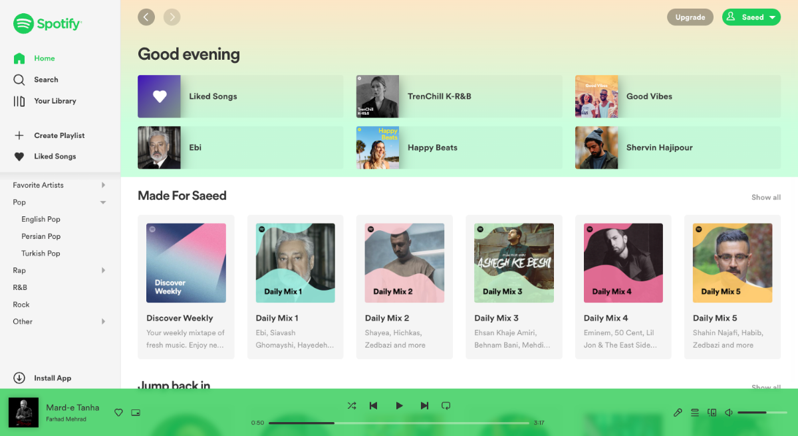

# Spotify Light Theme
Although most of the **Spotify** users in the idea center have asked to **add a light theme to Spotify**, but so far the color of this app is still **dark**.
With the description of this repository, you can **add a light theme** or any type of theme to the web version of this famous application. You can even **create your own custom spotify theme** by changing a few color variables. Let's do it.

**Table of Contents**

- [Features](#features)

- [How to use?](#how-to-use)

- [How to customize?](#how-to-customize)

- [Themes](#themes)

- [Screenshots](#screenshots)

## Features

- Several themes for Spotify including light themes
- Just with pure CSS and without changing the structure of Spotify
- Easy customization with support for CSS variables
- The ability to create your own custom theme just by changing a few color variables.

## How to use?

1) First, you need to install a browser extension in order to inject CSS to the site you visit. 

- you can use `User JavaScript and CSS` extension for Google Chrome. [Download and install here](https://chrome.google.com/webstore/detail/user-javascript-and-css/nbhcbdghjpllgmfilhnhkllmkecfmpld?hl=en "Download and install here").
- For other browsers, you can download and install the appropriate extension from the table below.

| Browser        | Extension   |  | Browser | Extension |
| :------------: | :------------: | :------------: | :------------: | :------------: |
|  |  <br/>[User JavaScript and CSS](https://chrome.google.com/webstore/detail/user-javascript-and-css/nbhcbdghjpllgmfilhnhkllmkecfmpld?hl=en "User JavaScript and CSS") <br/> <br/>  <br/> [Code Injector](https://chrome.google.com/webstore/detail/code-injector/edkcmfocepnifkbnbkmlcmegedeikdeb "Code Injector") | |  |  <br/> [Code Injector](https://addons.mozilla.org/en-US/firefox/addon/codeinjector/ "Code Injector")   | 
|  |  <br/> [Code Injector](https://microsoftedge.microsoft.com/addons/detail/kgmlfocfgenookigofalapefagndnlnc")| | 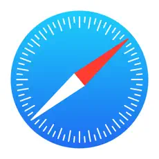 |  <br/> [Tamperish](https://apps.apple.com/cd/app/tamperish-for-safari/id1516885392?mt=12 "Tamperish") / [document](https://github.com/username0x0a/Tamperish "document") |

2) Then open the [Spotify website](https://open.spotify.com/ "Spotify website") and click on the extension and click `Add New` button.

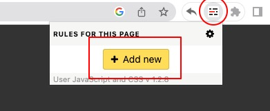

3) Now, in the CSS section, you should copy or import the theme css code.

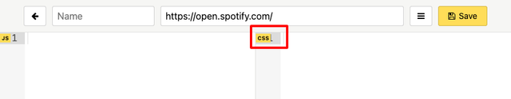

4) Go to the [theme folder](https://github.com/najafi-saeed/spotify-theme/tree/development/themes "folder") and choose your theme `themes/CHOOSE_THEME` and copy its css codes here and click on yellow save button. 

If you want to get repository updates automatically, you can use `Jsdelivr CDN` to load theme CSS file with this structure:

<pre>@import "https://cdn.jsdelivr.net/gh/najafi-saeed/spotify-theme/themes/<b>theme-folder</b>/<b>theme-file</b>.min.css";</pre>

for example you can copy:
```
@import "https://cdn.jsdelivr.net/gh/najafi-saeed/spotify-theme/themes/light-theme/light-theme.min.css";
```

5) Refresh Spotify site and enjoy your new theme.

## How to customize?
You can easily customize a theme by overwriting some CSS variables.

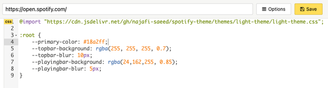

All CSS variables are listed here. You just need to copy them at the end of your file. Of course, if you master CSS, you can make more specialized changes.

```
:root {
  --background-color: #fff;
  --text-color: #333;
  --text-color-muted: #999;
  --border-color: #e5e5e5;
  --primary-color: #19ce5c;
  --primary-color-hover: #0dab47;
  --muted-color: #f5f5f5;
  --muted-color-hover: #caffde;
  /* sections */
  --topbar-background: rgba(255, 255, 255, 0.7);
  --topbar-blur: 10px;
  --home-hero-background: linear-gradient(rgba(255, 255, 255, .7) 0, var(--muted-color-hover) 80%);
  --leftbar-background: var(--muted-color);
  --playingbar-background: rgba(25,206,92, 0.85);
  --playingbar-blur: 5px;
  --playlist-hero-gradient:   rgba(255, 255, 255, 0.7);
  --playlist-hero-gradient-2: rgba(255, 255, 255, 0.6);
  /* buttons */
  --primary-button-background:       var(--primary-color);
  --primary-button-background-hover: var(--primary-color-hover);
  --primary-button-text:       #fff;
  --primary-button-text-hover: #fff;
  --primary-button-border:        0px solid var(--primary-button-background);
  --primary-button-border-hover:  0px solid var(--primary-button-background-hover);

  --secondary-button-background:        rgba(0, 0, 0, 0.35);
  --secondary-button-background-hover:  rgba(0, 0, 0, 0.7);
  --secondary-button-text:        #fff;
  --secondary-button-text-hover:  #fff;
  --secondary-button-border:        0px solid var(--secondary-button-background);
  --secondary-button-border-hover:  0px solid var(--secondary-button-background);
  /* scrollbar */
  --scrollbar-track-color: #eee;
  --scrollbar-handle-color: #c7c7c7;
  --scrollbar-handle-active-color: #999;
}
```
| Basic Light Theme  |    |
| :------------: | :------------: |
| **Customized Theme** | 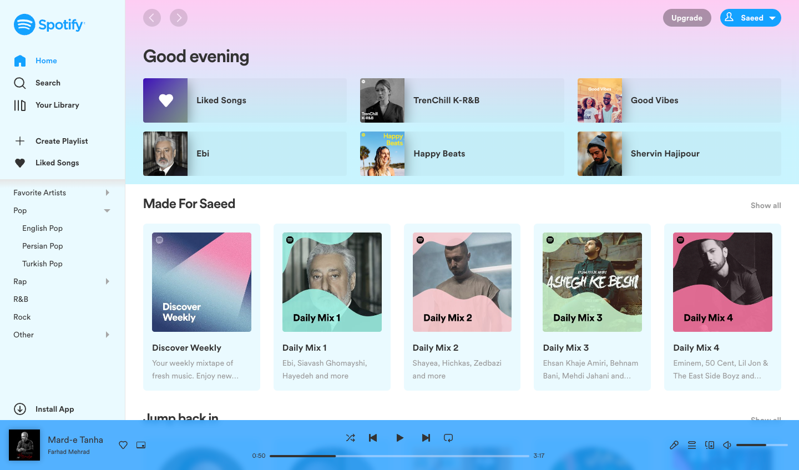  |

## Themes

In addition to the light theme, several other themes have also been developed, which you can see in the list.

- [light theme](themes/light-theme "light theme")
- [light blue theme](themes/light-blue-theme "light blue theme")
- [light purple theme](themes/light-purple-theme "light purple theme")
- [dark theme](themes/dark-theme "dark theme")
- [dark purple theme](themes/dark-purple-theme "dark purple theme")

## Screenshots

Here you can see some screenshots of the application pages. Really nice! The Blur effect has made the pages much more beautiful.

| <br> 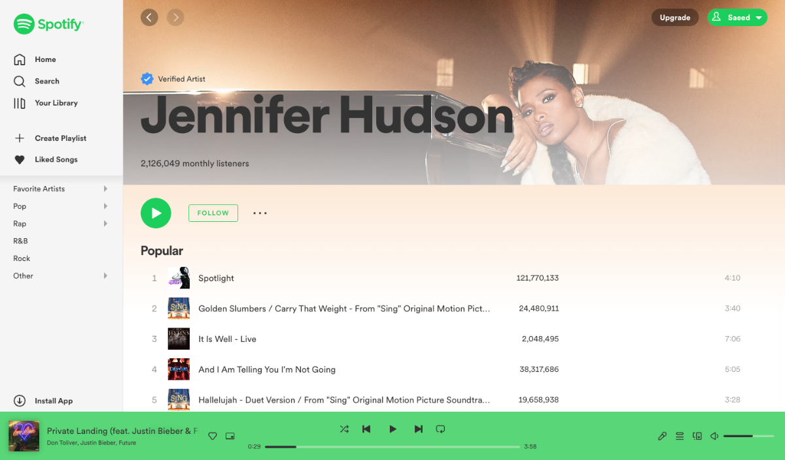 Artist Page  | <br> 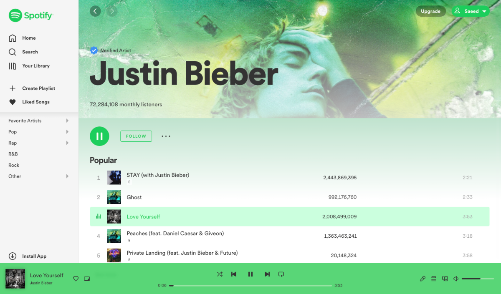 Artist Page  |
| :------------: | :------------: |
| <br> 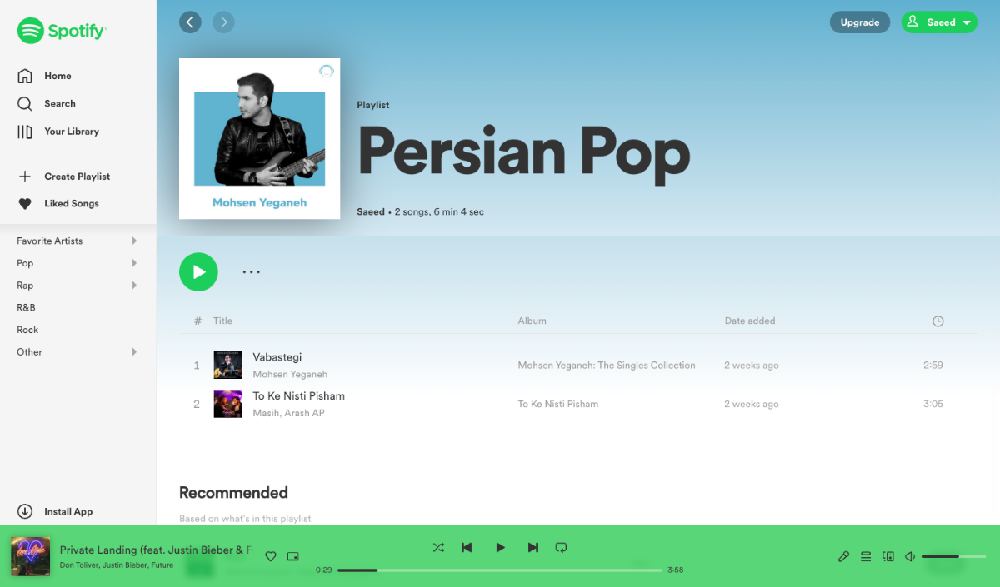 Playlist Page  | <br>  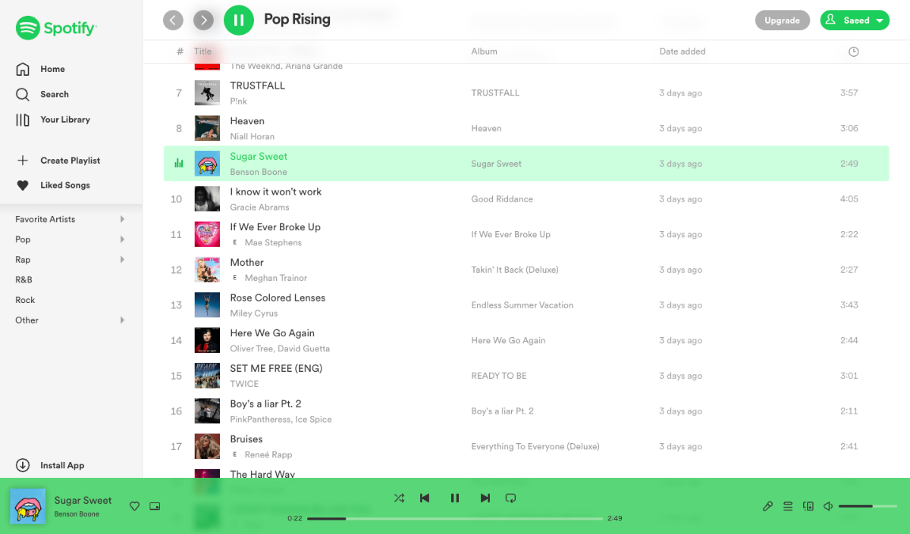 Playlist Page |
|  <br> 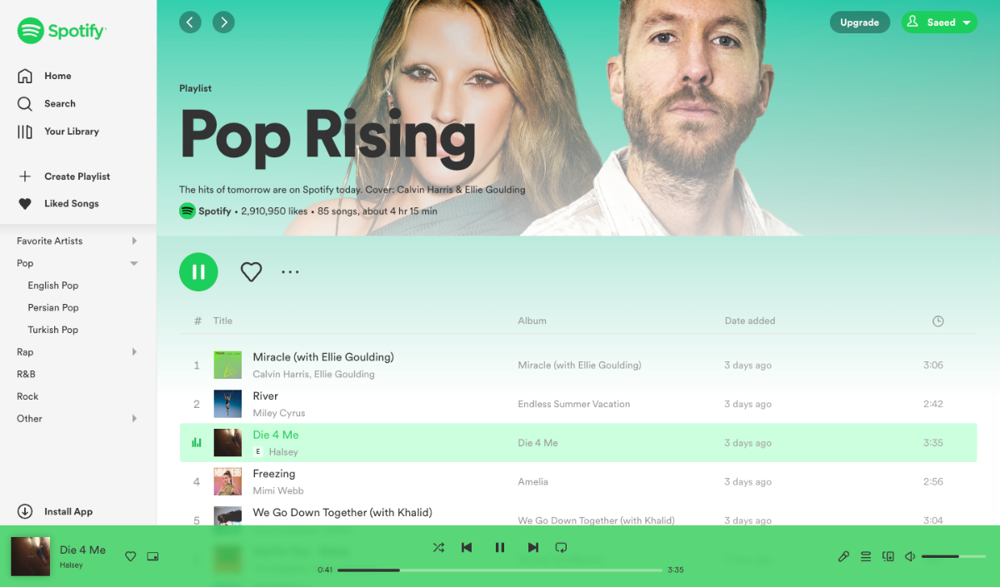 Playlist Page | <br> 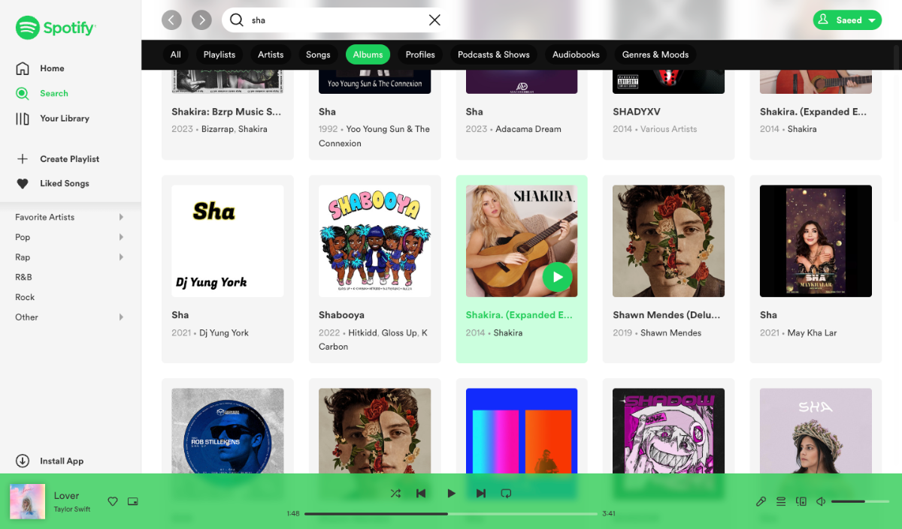 Search Page/ Albums |
| <br> 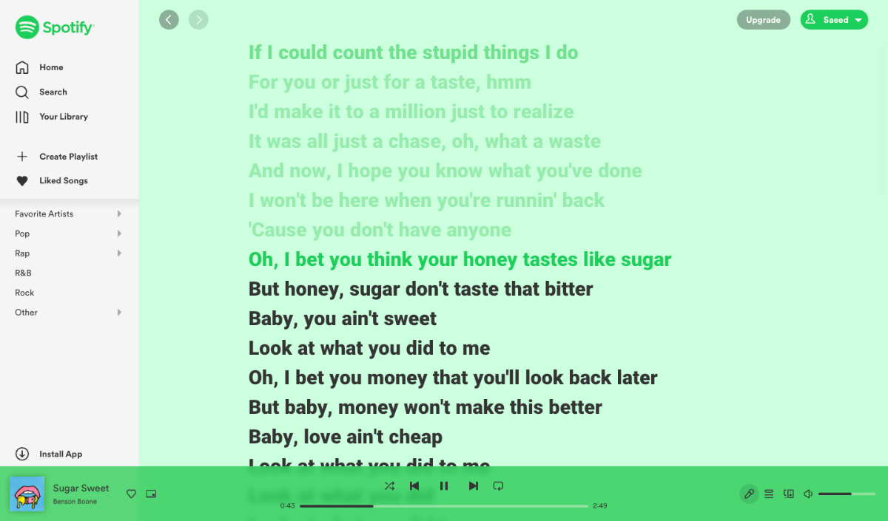 Lyric Page | <br> 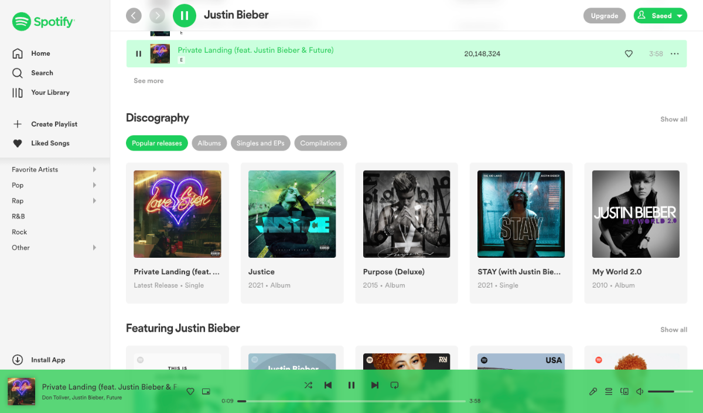 Discography Section |
| <br> 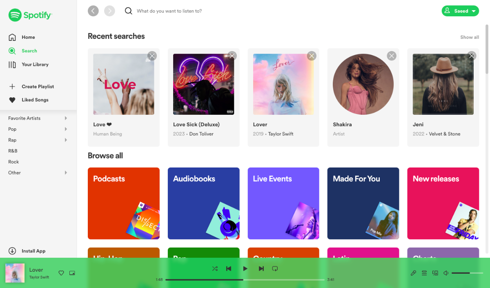 Search Page / Recent searches |  <br> 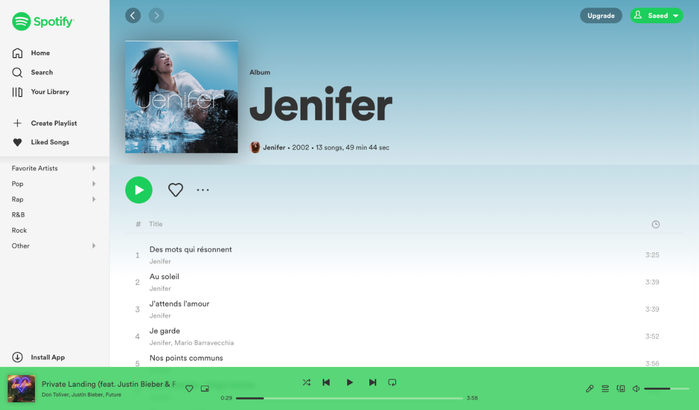 Album Page |
